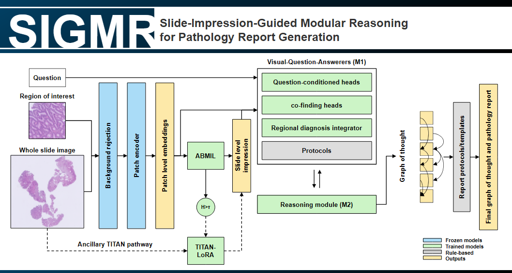

# SIGMR

### Slide-Impression-Guided Modular Reasoning for Pathology Report Generation

*Our entry to the [REG²2026](https://reg2026.grand-challenge.org) challenge (MICCAI 2026).*



From an H&E whole-slide image, SIGMR produces (A) a pathology report with its diagnostic
reasoning trajectory of Q&A pairs, and (B) per-ROI visual-grounding answers.

**Contact:** cpchang6@vghtpe.gov.tw, ccpvault00@gmail.com

**Method** is described in Part I, **instructions to reproduce inference** in Part II, and the
**model-weights download** in Part III. Our trained weights are hosted on Hugging Face at
**[ccpath/SIGMR](https://huggingface.co/ccpath/SIGMR)** (gated, access on request). Part II
re-creates every deployed checkpoint from the training data instead, if you prefer.

---

# Part I: Method

Following how a pathologist reads a slide, the pipeline is slide-level impression-first. A frozen tile
foundation model encodes each tile once, and an ABMIL head forms a slide-level diagnostic impression
from the cached tile features; every downstream head reads the same cached features and is conditioned
on that impression. The graph of thought is grown by a breadth-first traversal in which a reasoning
module (M2) proposes the clinically-appropriate follow-ups and answerer models (M1) answer each one from
the visual features, until the final report question is reached. Each M1-vqa answer is a predicted answer
embedding decoded by nearest neighbour in a fixed answer pool, not free-form generated text. The final
report is then assembled from the impression together with the details the trajectory establishes:
organ, procedure, histologic subtype, grade, and secondary findings.

```
WSI (20×, single level)
  │  tile @ 224px  →  H-Optimus-1  (frozen, 1536-d per tile)        src/interf1/extract.py
  ▼
tile features ─┬─ ABMIL primary        → #1 impression (139 graded classes) + OOD entropy
               ├─ M1-cls               → closed-set answers for the structured questions
               ├─ M1-vqa (2-anchor)    → anchor-conditioned answers (also serves Visual Grounding, interf0)
               ├─ M2                    → next question(s): grows the graph of thought
               ├─ co-finding tile heads ┐  two ways to detect secondary findings:
               ├─ region co-dx model    ┘  focal per-tile heads + diffuse 5 mm-region MIL
               └─ TITAN VL-LoRA         → manage out-of-distribution cases, gated on ABMIL entropy
                                          (lazy: only for uncertain cases with time budget left)
  ▼
breadth-first trajectory  →  report              src/reg2026_pipeline/scripts/reasoning_engine.py
```

| Component | Weights (`model/ckpts/…`) | Role |
|---|---|---|
| Tile encoder | `hf/…/H-optimus-1` (frozen) | 224px tile → 1536-d feature |
| ABMIL primary | `abmil_primary_dx.ckpt` | slide-level **#1 impression** (graded diagnosis) + softmax-entropy OOD signal |
| M1-cls | `m1_cls/` | closed-set classification head for structured questions |
| M1-vqa | `m1_vqa_2anchor/` | anchor-conditioned answerer: predicts an answer embedding, nearest-neighbour decoded in the answer pool (shared with Visual Grounding) |
| M2 (reasoning module) | `module2_next_q/` | proposes the next question(s) to grow the graph of thought |
| Co-finding heads | `cofinding/*.pt` + `configs/cofinding_heads.json` | per-tile co-finding gates |
| Region co-dx | `cofinding/codx_region_integrator.ckpt` | two-level MIL over 5 mm regions → co-diagnosis set |
| OOD | `titan/` + `titan_vl_lora_ce/` | TITAN VL-LoRA zero-shot for out-of-distribution slides |
| Answer space | `m1_answer_space/per_q_answer_space.json` | per-question legal answer sets |
| Embedding pools | `pools/` (MedCPT) | question/answer text embeddings for cosine answering |

Visual Grounding (interf0) reuses the M1-vqa answerer on the ROI thumbnail; background ROIs receive
non-diagnostic answers.

### Repository layout

```
reg2026-submission/
├── inference.py, core.py            # Grand Challenge entrypoint + interface dispatch
├── Dockerfile, requirements.txt     # runtime image (torch 2.9 / CUDA 12.8 + TRIDENT + TITAN)
├── do_build.sh, do_save.sh, do_test_run.sh
├── src/
│   ├── interf0/model.py             # Visual Grounding handler
│   ├── interf1/                     # Workflow Reasoning handler
│   │   ├── model.py                 # _inference_argv() = the deployed configuration
│   │   ├── extract.py               # per-case tiling + H-Optimus encoding
│   │   ├── codx_integrator.py       # region co-dx
│   │   └── titan_live.py            # TITAN VL-LoRA OOD
│   └── reg2026_pipeline/
│       ├── scripts/                 # training + evaluation + the reasoning engine
│       └── reg2026/                 # the library (aggregate, generate, module1, module2, protocols, …)
└── model/                           # weights + configs → mounted at /opt/ml/model/ (NOT in git)
    ├── ckpts/                       # the trained checkpoints (table above)
    ├── configs/                     # cofinding_heads.json, q_routing.json, split.json, train_CoT.json
    └── pools/                       # MedCPT embedding pools
```

---

# Part II: Reproducing the submitted results

The deployed configuration is the single source of truth: **`src/interf1/model.py::_inference_argv()`**
lists every flag and checkpoint path the container uses. Reproduction re-creates those checkpoints from
the training data and re-runs the engine. Paths below use the training scripts' `/mnt/data/reg2026/...`
defaults; point them at your own data root. A CUDA GPU is required.

### 1. Environment

```bash
conda create -n reg2026 python=3.11 -y && conda activate reg2026
pip install torch==2.9.1 torchvision --index-url https://download.pytorch.org/whl/cu128   # matches the Docker base image
pip install -r requirements.txt      # TRIDENT (+ H-Optimus), TITAN, transformers 4.57.6, peft
```

`requirements.txt` omits torch/torchvision (the Docker base image `pytorch/pytorch:2.9.1-cuda12.8-cudnn9-runtime`
provides them), so a local environment must install them first, as above. Download the gated H-Optimus-1,
TITAN, and MedCPT snapshots into `model/hf/` once; the container then loads them fully offline.

### 2. Tile features

Extract 20× / 224px tile features with **[TRIDENT](https://github.com/mahmoodlab/TRIDENT)** + H-Optimus-1
for all 11,220 training slides (the long pole; cache it once):

```bash
# some slides report an invalid MPP; build an override CSV TRIDENT will honour
python scripts/build_mpp_override_csv.py --wsi-dir /mnt/data/reg2026/wsi --out /mnt/data/reg2026/mpp_override.csv
# then TRIDENT batch extraction (H-Optimus-1, 20×, 224px, 0 overlap) → features_hoptimus1/<case>.h5 (dataset /features)
```

Validate with `python scripts/sanity_check_features.py`. The out-of-distribution TITAN path (step 4.8)
additionally needs CONCH v1.5 512px features: a second TRIDENT extraction (20× / 512px / CONCH-v1.5)
→ `features_conch_v15/<case>.h5`. All other steps use only the H-Optimus features.

### 3. Vocab / mask artifacts

```bash
python scripts/prep_embedding_pools.py --device cuda            # → model/pools/ (MedCPT Q/A pools)
python scripts/build_per_q_answer_space.py                      # → m1_answer_space/per_q_answer_space.json
python scripts/precompute_dag_masks.py --cot-json /mnt/data/reg2026/train_CoT.json \
    --output /mnt/data/reg2026/checkpoints/m1_answer_space/dag_masks.h5
python scripts/make_split.py --verify model/configs/split.json  # audit the deterministic organ-stratified split
```

### 4. Train the components

The trained checkpoints are shipped in the model tarball; the commands below document how they
were produced, and running the submission uses the released weights rather than retraining. Run
in order (later stages consume earlier checkpoints). Common flags: `--cot-json train_CoT.json`,
`--features-dir features_hoptimus1`, `--split-json split.json`.

| # | Component | Script | → checkpoint |
|---|---|---|---|
| 4.2a | **M1 cosine base** (b-qcond + scheduled sampling, pure nearest-neighbour cosine answering) | `train_module1.py --variant b-qcond --sched-sampling --dag-masks-h5 …` | `b_qcond_ss/` |
| 4.2b | **M1-cls** (base + closed-Q classification head) | `train_module1.py --variant b-qcond --init-ckpt …b_qcond_ss/best.ckpt --per-q-answer-space per_q_answer_space.json --cls-loss-weight <w> --dag-masks-h5 …` | `m1_cls/` |
| 4.3 | **M1-vqa** (base → 2-anchor + VG) | `train_m1_vqa.py --variant b-qcond --drop-proc-anchor --schedsamp-rate 0.2 --init-ckpt …b_qcond_ss/best.ckpt` | `m1_vqa_2anchor/` |
| 4.4 | **M2** (next question) | `train_module2.py --predictions-json …/predictions_all.json --a-mix-ratio 0.5` | `module2_next_q/` |
| 4.5 | ABMIL **#1-dx primary** | `train_abmil_primary.py` | `abmil_primary_dx.ckpt` |
| 4.6 | **Co-finding** tile heads | `train_cofinding_heads.py` (presence-Q) + `train_codx_detector_heads.py` (DCIS/CIS) | `*.pt` + `configs/cofinding_heads.json` |
| 4.7 | **Region co-dx** | `train_codx_region_encoder.py` → `train_codx_integrator.py` | `codx_region_integrator.ckpt` |
| 4.8 | **TITAN VL-LoRA** (OOD) | `train_titan_vl_lora.py` (needs CONCH v1.5 512px feats) | `titan_vl_lora_ce/` |

Steps 4.2a–4.3 share the cosine base `b_qcond_ss`: **M1-cls** warm-starts from it and adds the
closed-Q classification head, while **M1-vqa** warm-starts from it and reduces the context to two
anchors (organ + slide impression). Neither is fine-tuned from the other.

Representative invocation (M1 cosine base; M1-cls adds `--per-q-answer-space` + `--cls-loss-weight`);
`<cot>`/`<split>`/`<hopt>`/`<conch_v15>`/`<out>` are your data paths:

```bash
python scripts/train_module1.py --variant b-qcond --sched-sampling \
    --cot-json <cot> --dag-masks-h5 …/dag_masks.h5 --features-dir <hopt> \
    --split-json <split> --output-dir <out>/b_qcond_ss --num-epochs 25 --batch-size 8 --num-workers 8
# M1-cls: rerun with  --init-ckpt <out>/b_qcond_ss/best.ckpt --per-q-answer-space per_q_answer_space.json --cls-loss-weight <w> --output-dir <out>/m1_cls

# 4.5  #1-dx ABMIL primary → abmil_primary_dx.ckpt
python scripts/train_abmil_primary.py --cot-json <cot> --split-json <split> --features-dir <hopt> --output-dir <out>/abmil_primary_dx

# 4.6  co-finding presence-Q heads + DCIS/CIS co-dx heads
python scripts/train_cofinding_heads.py     --cot-json <cot> --split-json <split> --features-dir <hopt> --output-dir <out>/cofinding
python scripts/train_codx_detector_heads.py --cot-json <cot> --split-json <split> --features-dir <hopt> --output-dir <out>/codx_detectors

# 4.7  region co-dx: Stage 1 (region encoder) then Stage 2 (joint integrator)
python scripts/train_codx_region_encoder.py --cot-json <cot> --split-json <split> --features-dir <hopt> \
    --primary-ckpt model/ckpts/abmil_primary_dx.ckpt --output-dir <out>/codx_region_encoder
python scripts/train_codx_integrator.py     --cot-json <cot> --split-json <split> --features-dir <hopt> \
    --primary-ckpt model/ckpts/abmil_primary_dx.ckpt \
    --region-encoder-ckpt <out>/codx_region_encoder/best.ckpt --output-dir <out>/codx_region_integrator

# 4.8  TITAN VL-LoRA (OOD; uses the CONCH v1.5 512px features)
python scripts/train_titan_vl_lora.py --cot-json <cot> --split-json model/configs/split.json \
    --conch-features-dir <conch_v15> --titan-dir model/ckpts/titan --output-dir model/ckpts/titan_vl_lora_ce
```

The bladder urothelial-CIS co-finding head is the direct-on-H-Optimus `cofinding/cis_bladder.pt`, so the
whole pipeline depends on H-Optimus alone.

### 5. Assemble `model/`

Copy the trained checkpoints to their deployed names under `model/ckpts/` (exactly the paths
`_inference_argv()` reads) and the configs to `model/configs/` (`cofinding_heads.json`, `q_routing.json`,
`split.json`, `train_CoT.json`).

### 6. Run inference & score

```bash
# full-val trajectory dump with the exact deployed configuration (--deterministic → reproducible)
REG_POOL_DIR=model/pools PYTHONPATH=src/reg2026_pipeline \
python src/reg2026_pipeline/scripts/reasoning_engine.py \
    --variant b-qcond \
    --abmil-primary-ckpt model/ckpts/abmil_primary_dx.ckpt \
    --module1-ckpt model/ckpts/m1_cls/epoch_024.ckpt \
    --m1cls-answer-space model/ckpts/m1_answer_space/per_q_answer_space.json \
    --m1-vqa-ckpt model/ckpts/m1_vqa_2anchor/best.ckpt --m1-vqa-drop-proc-anchor \
    --module2-ckpt model/ckpts/module2_next_q/best.ckpt \
    --m2-gate-context --normalize-glitches --m2-top-k-from-train --bfs-allow-revisit \
    --cofinding-heads-json model/configs/cofinding_heads.json --codx-independent-subtree \
    --routing-config model/configs/q_routing.json --dx-subspace-guard --gleason-from-patterns \
    --split-json <split.json> --cot-json <train_CoT.json> --features-dir <features_hoptimus1> \
    --deterministic --dump-official-pred-json /tmp/pred.json

# score against the official REG evaluator (Workflow Reasoning + Final Report)
PYTHONPATH=src/reg2026_pipeline python src/reg2026_pipeline/scripts/run_official_eval.py \
    --official-pred-json /tmp/pred.json --official-repo <path-to-official-evaluation-code>
# Visual Grounding
PYTHONPATH=src/reg2026_pipeline python src/reg2026_pipeline/scripts/run_official_vg.py
```

The flag block is exactly what the container passes (see `_inference_argv()`); a single-case container
run performs the same steps behind `inference.py`.

---

# Part III: Model weights

Our trained weights are **not** committed to this repository. They are hosted on
Hugging Face at **[ccpath/SIGMR](https://huggingface.co/ccpath/SIGMR)**. The model is **gated**:
requests are reviewed manually, so please request access on the model page first. Once approved,
authenticate and pull everything into `model/`:

```bash
pip install -U "huggingface_hub[cli]"
# 1. Request access at https://huggingface.co/ccpath/SIGMR (manual approval)
hf auth login                        # 2. paste an access token, after approval
hf download ccpath/SIGMR --repo-type model --local-dir model   # 3. download
```

This restores the exact `model/` layout `_inference_argv()` reads: the trained checkpoints
(`model/ckpts/`), the MedCPT pools (`model/pools/`), and the routing and co-finding configs
(`model/configs/q_routing.json`, `model/configs/cofinding_heads.json`). Two categories are **not** on that
repo and are obtained separately:

- **Foundation models** (H-Optimus-1, TITAN, MedCPT): download the gated snapshots from their official
  sources into `model/hf/` (Part II § 1).
- **Challenge data** (`train_CoT.json`, `split.json`): recreate from the official training set (Part II § 3).

At run time the weights are provided as a separate `model.tar.gz` mounted at `/opt/ml/model/` (not baked
into the image; loaded via `MODEL_PATH` from `core.py`).


